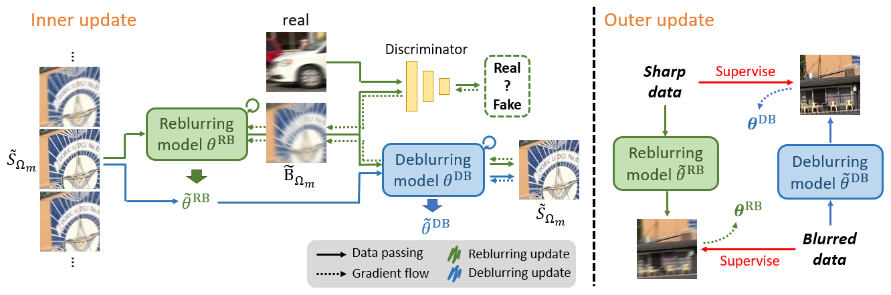

# Meta Transferring for Deblurring (BMVC 2022)
Pytorch implementation of "[Meta Transferring for Deblurring]()" (BMVC 2022). <br />
The implementation use part of the code from [MPRNet](https://github.com/swz30/MPRNet), [MTRNN](https://github.com/Dong1P/MTRNN), [Restormer](https://github.com/swz30/Restormer), and [CDVD-TSP](https://github.com/csbhr/CDVD-TSP).



## Environment
- Nvidia A5000 GPU
- cuda 11.3
- pytorch == 1.10.1+cu113
- numpy == 1.22.0

## Installation
```
pip3 install -r requirements.txt
```

## Meta training
1. Download "[GOPRO](https://seungjunnah.github.io/Datasets/datasets)" dataset or any dataset that you want to use.
2. Move pre-trained weights into *./weights*.
3. Modify the arguments in **meta training** script and run the script.
```
sh meta_train.sh
```

## Meta testing
1. Download "[DVD](https://www.cs.ubc.ca/labs/imager/tr/2017/DeepVideoDeblurring/)", "[REDS](https://seungjunnah.github.io/Datasets/datasets)",or "[RealBlur](http://cg.postech.ac.kr/research/realblur/)" dataset or any dataset that you want to test.
2. Modify the arguments in **meta testing** script and run the script.
```
sh meta_test_script.sh
```

## Important args
- **save_dir:** *The saved path of current experiment directory*
- **dataset:** *The dataset name (GOPRO/DVD/REDS/RealBlur)*
- **dataset_dir:** *The path to dataset*
- **deblur(reblur)_lr:** *Learning rate for deblurring(reblurring) model*
- **deblur_model:** *The deblurring model name (mprnet/mtrnn/restormer/cdvd_tsp)*
- **gan:** *Using adversarial loss during inner update or not*
- **cycle_update:** *Using cycle consistency loss during inner update or not*
- **n_updates:** *# of support patches during inner update*
- **deblur(reblur/gan)_model_path:** *The path of pre-trained model weight*


## Train/Test reblurring model
We train our reblurring model for 1000 epochs.
```
# Training
sh train.sh

# Testing
sh test.sddh
```

<!---
## Settings
|            | MPRNet | MTRNN | Restormer | CDVD-TSP|
|  -:-       |  -:-   |  -:-  |   -:-     |   -:-   |
|     DVD    |  |  |  |  |
|    REDS    |  |  |  |  |
| RealBlur_J |  |  |  |  |

-->

## Model/Dataset extension
- Model
    - Modify *./model/setting.yaml*
    - Modify *./model/basicModule.py*
    - Modify *./loss/loss.py*

- Dataset
    - Create *./dataset/meta_(modelName).py*
    - Copy *./dataset/meta_gopro.py* to *./dataset/meta_(modelName).py*
    - Modify dataset hierachy in the file

## Citation
